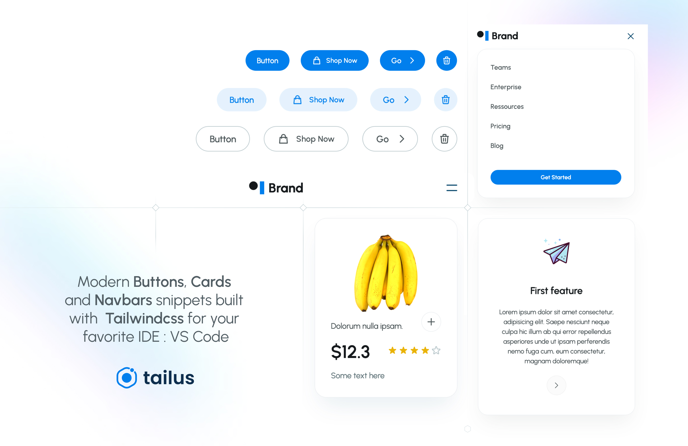

# Tailus Snippets

Eazy to customize Modern and beautifull UI components built with tailwindcss 
that you can use right in your favorite IDE, VS Code without copying from somewhere.

Our components set contains :

### Buttons

- Size (sm, md, lg)
- emphasis (hight, medium, low)
- Border radius (full-rounded, rounded, unrounded) 
- Icon placement (leading, trailing, icon-only).

### Cards

- Blog (horizontal, vertical)
- Features (Elevated, flat)

### Navbars 

- Simple
- Animated (with js)
- With Search bar
- With ligh-dark theme switcher

## Features

- ✨ Modern
- 📱 Responsive
- 🌓 Light and Dark Modern
- 🛠 Built on top of frontend techs

## How to use

VS Code makes snippets easier to use, all you need to get started :

- Install Tailus Snippets [extension](https://marketplace.visualstudio.com/items?itemName=TailusUI.snippus)
- Type `tailus-btn` for Buttons
- Type `tailus-cards` for Cards
- Type `tailus-navbar` for Navbars

Note that buttons contains many variants (size, emphasis, border-radius and icon placement), to use them eficiently include all variants in the prefix by separating with ":".

- eg `tailus-btn:lg:mde:leading` : size:lg emphasis:medium icon-placement:leading
- eg `tailus-btn:lg:low:unrounded:icon` : size:lg emphasis:low icon-placement:icon-only border-radius:unrounded

When you don't include a variant, the snippet will use the default values

## Contribute

If you're interested in contributing to Tailus Blocks, please read our [contributing docs](CONTRIBUTING.md) before submitting a pull request.

[How to get started](https://code.visualstudio.com/api/get-started/your-first-extension)

## More ressources

[Browse more ressources](https://tailus.io)